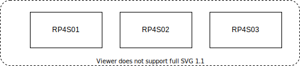

# K3S Infrastructure

|Node name | OS           | HW           |
|----------|--------------|--------------|
|RP4S01    |Ubuntu 20.04  | RP 4 4GB     |
|RP4S02    |Ubuntu 20.04  | RP 4 8GB     |
|RP4S03    |Ubuntu 20.04  | RP 4 8GB     |

Installed Ubuntu 20.04 LTS  
<https://help.ubuntu.com>  

`sudo apt-get update`  
`sudo apt-get upgrade`  

## Check HW

`sudo lshw`  

### inxi

`sudo apt-get install inxi`  
`inxi -F`  

## Hostname

### Display

hostnamectl  
`cat /etc/hostname`  

## Install kubernetes cluster

<https://opensource.com/article/20/6/kubernetes-raspberry-pi>

### Additions to instruction

Adding flanel network addon:

`sudo kubectl apply -f https://raw.githubusercontent.com/coreos/flannel/master/Documentation/kube-flannel.yml`

Adding proxy:

`kubectl proxy --port=8080&`

To get:

`sudo curl http://localhost:8080/api/`
